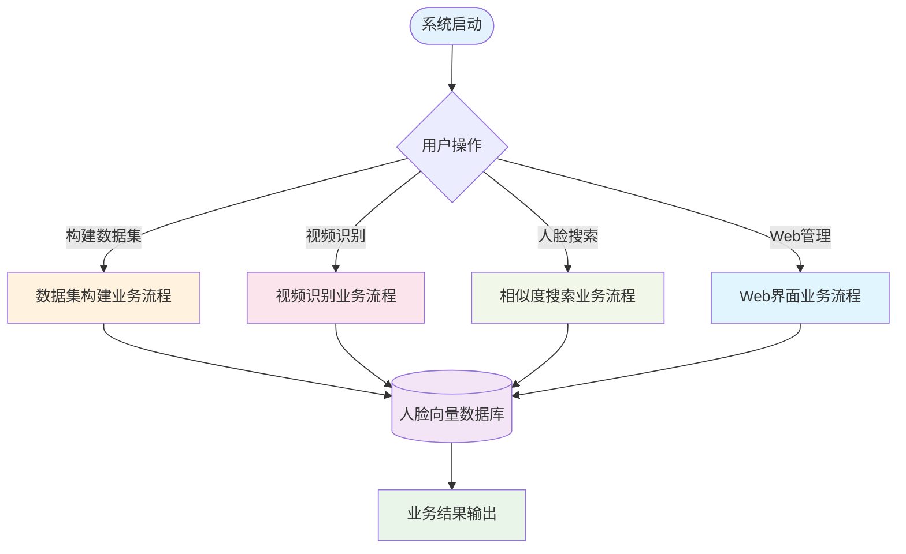
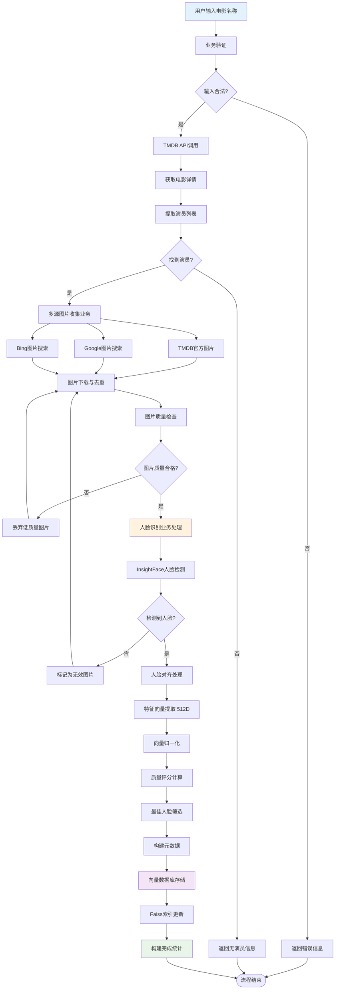
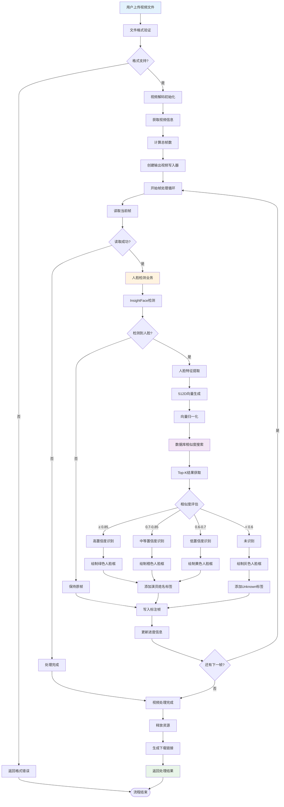
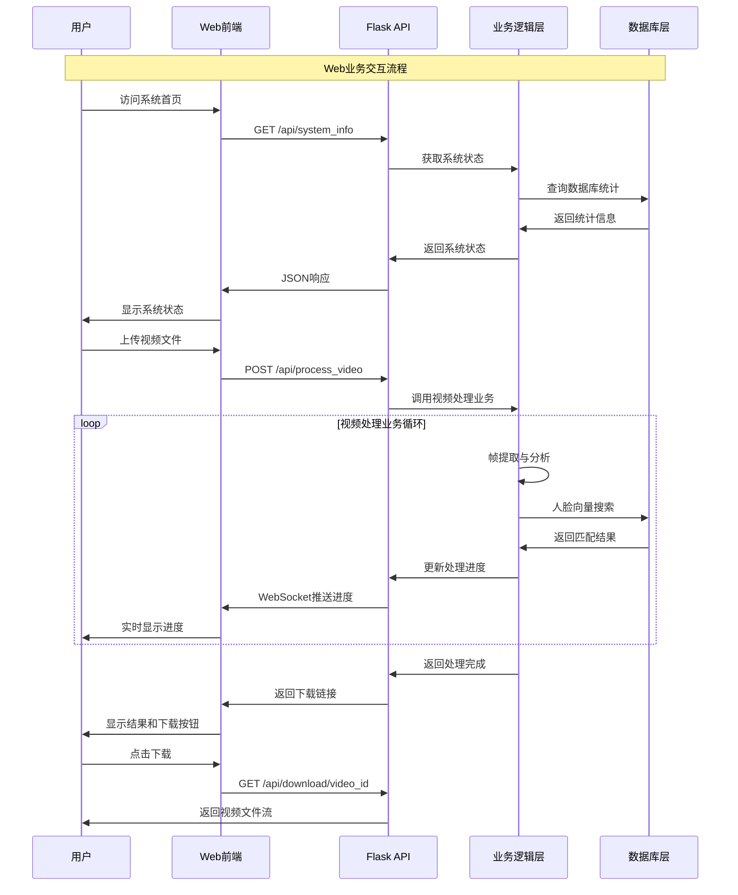
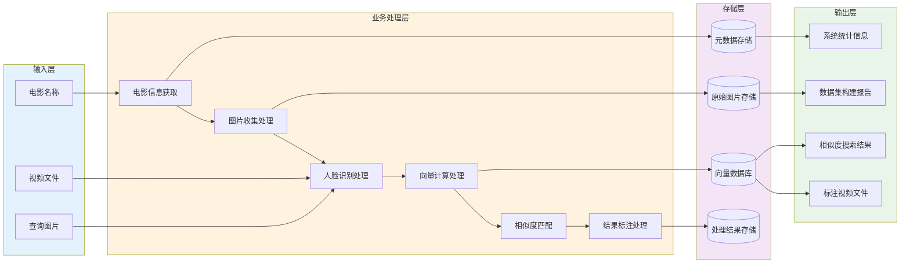
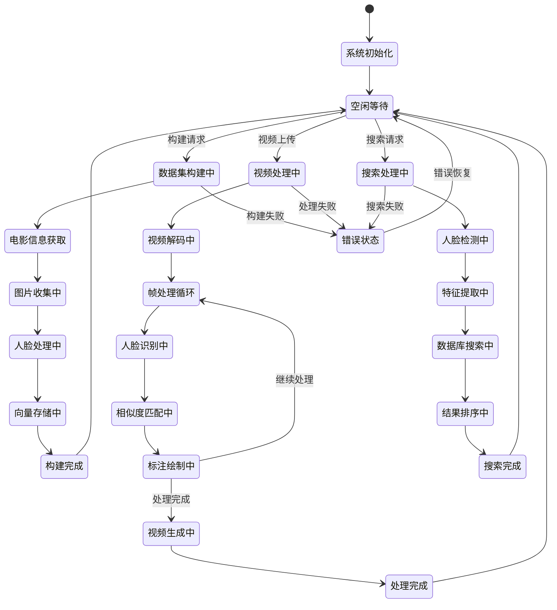

# 🎯 电影演员人脸识别系统 - 核心业务逻辑流程图

## 🏗️ 系统总体核心业务流程

```mermaid
flowchart TB
    Start([系统启动]) --> UserInput{用户操作}
    
    UserInput -->|构建数据集| BuildFlow[数据集构建业务流程]
    UserInput -->|视频识别| VideoFlow[视频识别业务流程]  
    UserInput -->|人脸搜索| SearchFlow[相似度搜索业务流程]
    UserInput -->|Web管理| WebFlow[Web界面业务流程]
    
    BuildFlow --> Database[(人脸向量数据库)]
    VideoFlow --> Database
    SearchFlow --> Database
    WebFlow --> Database
    
    Database --> Results[业务结果输出]
    
    style Start fill:#e3f2fd
    style Database fill:#f3e5f5
    style Results fill:#e8f5e8
    style BuildFlow fill:#fff3e0
    style VideoFlow fill:#fce4ec
    style SearchFlow fill:#f1f8e9
    style WebFlow fill:#e1f5fe
```

## 📊 核心业务流程1：数据集构建

```mermaid
flowchart TD
    A1[用户输入电影名称] --> A2[业务验证]
    A2 --> A3{输入合法?}
    A3 -->|否| A4[返回错误信息]
    A3 -->|是| A5[TMDB API调用]
    
    A5 --> A6[获取电影详情]
    A6 --> A7[提取演员列表]
    A7 --> A8{找到演员?}
    A8 -->|否| A9[返回无演员信息]
    A8 -->|是| A10[多源图片收集业务]
    
    A10 --> A11[TMDB官方图片]
    A10 --> A12[Google图片搜索]
    A10 --> A13[Bing图片搜索]
    
    A11 --> A14[图片下载与去重]
    A12 --> A14
    A13 --> A14
    
    A14 --> A15[图片质量检查]
    A15 --> A16{图片质量合格?}
    A16 -->|否| A17[丢弃低质量图片]
    A16 -->|是| A18[人脸识别业务处理]
    
    A18 --> A19[InsightFace人脸检测]
    A19 --> A20{检测到人脸?}
    A20 -->|否| A21[标记为无效图片]
    A20 -->|是| A22[人脸对齐处理]
    
    A22 --> A23[特征向量提取 512D]
    A23 --> A24[向量归一化]
    A24 --> A25[质量评分计算]
    A25 --> A26[最佳人脸筛选]
    
    A26 --> A27[构建元数据]
    A27 --> A28[向量数据库存储]
    A28 --> A29[Faiss索引更新]
    A29 --> A30[构建完成统计]
    
    A17 --> A14
    A21 --> A14
    A4 --> End([流程结束])
    A9 --> End
    A30 --> End
    
    style A1 fill:#e3f2fd
    style A18 fill:#fff3e0
    style A28 fill:#f3e5f5
    style A30 fill:#e8f5e8
```

## 🎥 核心业务流程2：视频人脸识别

```mermaid
flowchart TD
    B1[用户上传视频文件] --> B2[文件格式验证]
    B2 --> B3{格式支持?}
    B3 -->|否| B4[返回格式错误]
    B3 -->|是| B5[视频解码初始化]
    
    B5 --> B6[获取视频信息]
    B6 --> B7[计算总帧数]
    B7 --> B8[创建输出视频写入器]
    B8 --> B9[开始帧处理循环]
    
    B9 --> B10[读取当前帧]
    B10 --> B11{读取成功?}
    B11 -->|否| B12[处理完成]
    B11 -->|是| B13[人脸检测业务]
    
    B13 --> B14[InsightFace检测]
    B14 --> B15{检测到人脸?}
    B15 -->|否| B16[保持原帧]
    B15 -->|是| B17[人脸特征提取]
    
    B17 --> B18[512D向量生成]
    B18 --> B19[向量归一化]
    B19 --> B20[数据库相似度搜索]
    B20 --> B21[Top-K结果获取]
    
    B21 --> B22{相似度评估}
    B22 -->|≥ 0.85| B23[高置信度识别]
    B22 -->|0.7-0.85| B24[中等置信度识别]
    B22 -->|0.6-0.7| B25[低置信度识别]
    B22 -->|< 0.6| B26[未识别]
    
    B23 --> B27[绘制绿色人脸框]
    B24 --> B28[绘制橙色人脸框]
    B25 --> B29[绘制黄色人脸框]
    B26 --> B30[绘制灰色人脸框]
    
    B27 --> B31[添加演员姓名标签]
    B28 --> B31
    B29 --> B31
    B30 --> B32[添加Unknown标签]
    
    B31 --> B33[写入标注帧]
    B32 --> B33
    B16 --> B33
    
    B33 --> B34[更新进度信息]
    B34 --> B35{还有下一帧?}
    B35 -->|是| B9
    B35 -->|否| B36[视频处理完成]
    
    B36 --> B37[释放资源]
    B37 --> B38[生成下载链接]
    B38 --> B39[返回处理结果]
    
    B4 --> End([流程结束])
    B12 --> B36
    B39 --> End
    
    style B1 fill:#e3f2fd
    style B13 fill:#fff3e0
    style B20 fill:#f3e5f5
    style B39 fill:#e8f5e8
```

## 🔍 核心业务流程3：人脸相似度搜索

```mermaid
flowchart TD
    C1[用户上传查询图片] --> C2[图片格式验证]
    C2 --> C3{格式合法?}
    C3 -->|否| C4[返回格式错误]
    C3 -->|是| C5[图片预处理]
    
    C5 --> C6[InsightFace人脸检测]
    C6 --> C7{检测到人脸?}
    C7 -->|否| C8[返回无人脸错误]
    C7 -->|是| C9[选择最佳人脸]
    
    C9 --> C10[人脸对齐处理]
    C10 --> C11[特征向量提取]
    C11 --> C12[向量归一化]
    C12 --> C13[Faiss数据库搜索]
    
    C13 --> C14[计算相似度分数]
    C14 --> C15[Top-K结果排序]
    C15 --> C16[结果过滤]
    C16 --> C17[构建返回数据]
    
    C17 --> C18[添加演员信息]
    C18 --> C19[添加相似度分数]
    C19 --> C20[添加图片路径]
    C20 --> C21[格式化输出结果]
    
    C4 --> End([流程结束])
    C8 --> End
    C21 --> End
    
    style C1 fill:#e3f2fd
    style C6 fill:#fff3e0
    style C13 fill:#f3e5f5
    style C21 fill:#e8f5e8
```

## 🌐 核心业务流程4：Web界面交互

```mermaid
sequenceDiagram
    participant User as 用户
    participant Web as Web前端
    participant API as Flask API
    participant Business as 业务逻辑层
    participant DB as 数据库层
    
    Note over User,DB: Web业务交互流程
    
    User->>Web: 访问系统首页
    Web->>API: GET /api/system_info
    API->>Business: 获取系统状态
    Business->>DB: 查询数据库统计
    DB->>Business: 返回统计信息
    Business->>API: 返回系统状态
    API->>Web: JSON响应
    Web->>User: 显示系统状态
    
    User->>Web: 上传视频文件
    Web->>API: POST /api/process_video
    API->>Business: 调用视频处理业务
    
    loop 视频处理业务循环
        Business->>Business: 帧提取与分析
        Business->>DB: 人脸向量搜索
        DB->>Business: 返回匹配结果
        Business->>API: 更新处理进度
        API->>Web: WebSocket推送进度
        Web->>User: 实时显示进度
    end
    
    Business->>API: 返回处理完成
    API->>Web: 返回下载链接
    Web->>User: 显示结果和下载按钮
    
    User->>Web: 点击下载
    Web->>API: GET /api/download/video_id
    API->>User: 返回视频文件流
```

## 🎯 数据流转核心业务逻辑

```mermaid
flowchart LR
    subgraph Input[输入层]
        I1[电影名称]
        I2[视频文件]
        I3[查询图片]
    end
    
    subgraph Process[业务处理层]
        P1[电影信息获取]
        P2[图片收集处理]
        P3[人脸识别处理]
        P4[向量计算处理]
        P5[相似度匹配]
        P6[结果标注处理]
    end
    
    subgraph Storage[存储层]
        S1[(原始图片存储)]
        S2[(向量数据库)]
        S3[(元数据存储)]
        S4[(处理结果存储)]
    end
    
    subgraph Output[输出层]
        O1[数据集构建报告]
        O2[标注视频文件]
        O3[相似度搜索结果]
        O4[系统统计信息]
    end
    
    I1 --> P1
    I2 --> P3
    I3 --> P3
    
    P1 --> P2
    P2 --> P3
    P3 --> P4
    P4 --> P5
    P5 --> P6
    
    P2 --> S1
    P4 --> S2
    P1 --> S3
    P6 --> S4
    
    S1 --> O1
    S2 --> O2
    S2 --> O3
    S3 --> O4
    
    style Input fill:#e3f2fd
    style Process fill:#fff3e0
    style Storage fill:#f3e5f5
    style Output fill:#e8f5e8
```

## 🔄 系统核心业务状态机

```mermaid
stateDiagram-v2
    [*] --> 系统初始化
    系统初始化 --> 空闲等待
    
    空闲等待 --> 数据集构建中 : 构建请求
    空闲等待 --> 视频处理中 : 视频上传
    空闲等待 --> 搜索处理中 : 搜索请求
    
    数据集构建中 --> 电影信息获取
    电影信息获取 --> 图片收集中
    图片收集中 --> 人脸处理中
    人脸处理中 --> 向量存储中
    向量存储中 --> 构建完成
    构建完成 --> 空闲等待
    
    视频处理中 --> 视频解码中
    视频解码中 --> 帧处理循环
    帧处理循环 --> 人脸识别中
    人脸识别中 --> 相似度匹配中
    相似度匹配中 --> 标注绘制中
    标注绘制中 --> 帧处理循环 : 继续处理
    标注绘制中 --> 视频生成中 : 处理完成
    视频生成中 --> 处理完成
    处理完成 --> 空闲等待
    
    搜索处理中 --> 人脸检测中
    人脸检测中 --> 特征提取中
    特征提取中 --> 数据库搜索中
    数据库搜索中 --> 结果排序中
    结果排序中 --> 搜索完成
    搜索完成 --> 空闲等待
    
    数据集构建中 --> 错误状态 : 构建失败
    视频处理中 --> 错误状态 : 处理失败
    搜索处理中 --> 错误状态 : 搜索失败
    错误状态 --> 空闲等待 : 错误恢复
```
