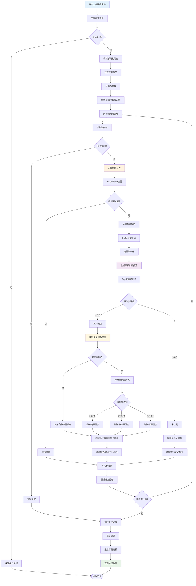
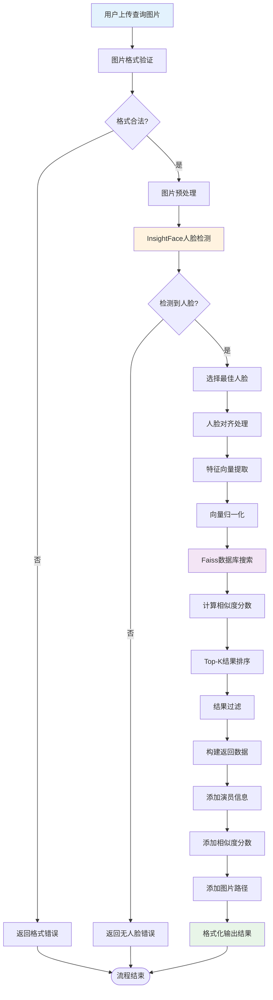
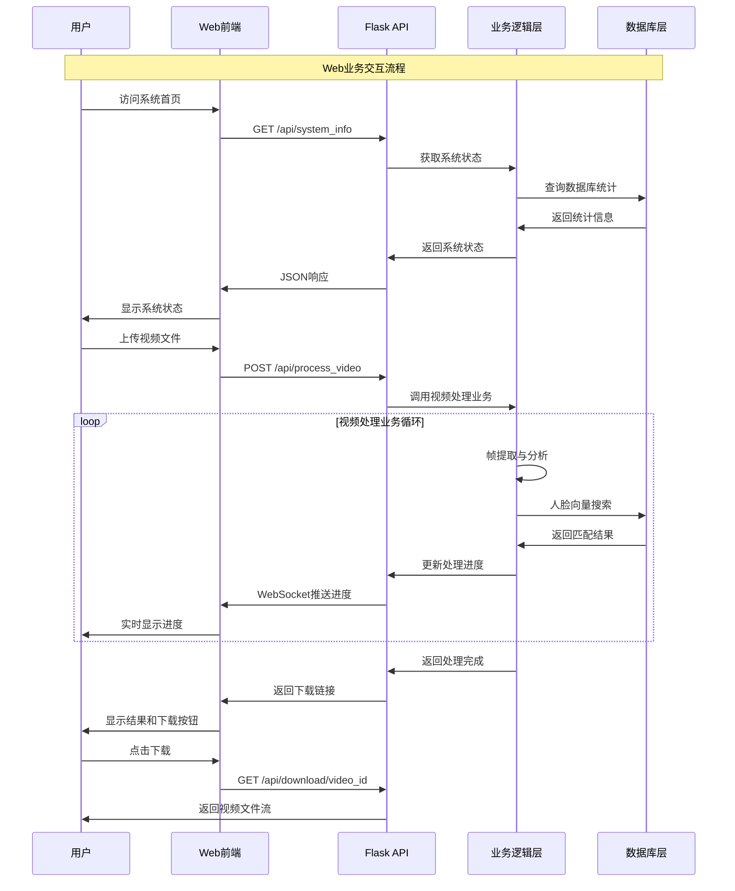
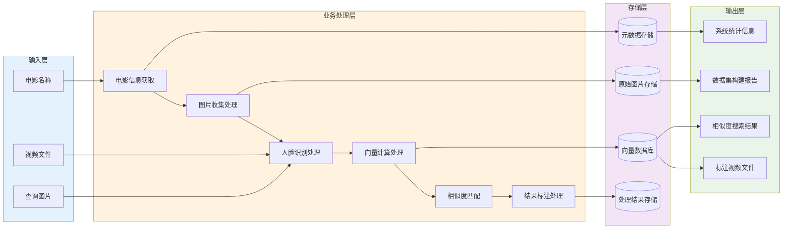
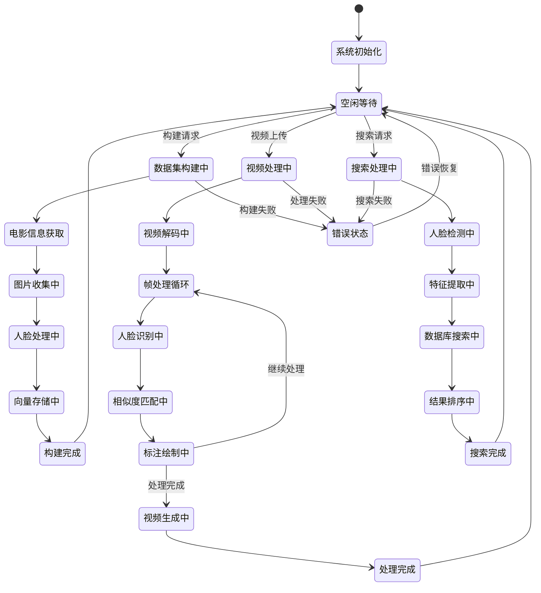

# 🎯 电影演员人脸识别系统 - 核心业务逻辑流程图

## 🏗️ 系统总体核心业务流程


## 📊 核心业务流程1：数据集构建


## 🎥 核心业务流程2：视频人脸识别



## 🎨 核心业务流程3：颜色管理与人脸框绘制

```mermaid
flowchart TD
    C1[人脸识别结果] --> C2{识别成功?}
    C2 -->|否| C3[使用灰色框标记未知]
    C2 -->|是| C4[获取元数据信息]
    
    C4 --> C5[提取角色名称]
    C5 --> C6[查询角色颜色配置]
    C6 --> C7{找到专属颜色?}
    
    C7 -->|是| C8[使用角色专属颜色]
    C7 -->|否| C9[使用置信度备用颜色]
    
    C8 --> C10[获取颜色配置信息]
    C10 --> C11[color_bgr: 颜色值]
    C10 --> C12[shape_type: 框形类型]
    C10 --> C13[line_thickness: 线条粗细]
    
    C9 --> C14{置信度级别评估}
    C14 -->|≥ 0.85| C15[绿色 - 高置信度]
    C14 -->|0.7-0.85| C16[橙色 - 中等置信度] 
    C14 -->|0.6-0.7| C17[黄色 - 低置信度]
    
    C11 --> C18[根据形状类型绘制]
    C12 --> C18
    C13 --> C18
    C15 --> C19[绘制矩形框]
    C16 --> C19
    C17 --> C19
    
    C18 --> C20{形状类型判断}
    C20 -->|rectangle| C21[绘制矩形框]
    C20 -->|rounded_rectangle| C22[绘制圆角矩形]
    C20 -->|circle| C23[绘制圆形框]
    C20 -->|ellipse| C24[绘制椭圆框]
    C20 -->|diamond| C25[绘制菱形框]
    
    C21 --> C26[添加文字标签]
    C22 --> C26
    C23 --> C26
    C24 --> C26
    C25 --> C26
    C19 --> C26
    C3 --> C27[添加"未知"标签]
    
    C26 --> C28[优先显示角色名称]
    C28 --> C29[备用显示演员名称]
    C29 --> C30[添加相似度分数]
    C27 --> C31[使用白色文字+黑色描边]
    
    C30 --> C32[完成人脸标注]
    C31 --> C32
    
    style C1 fill:#e3f2fd
    style C8 fill:#fff3e0
    style C18 fill:#f3e5f5
    style C32 fill:#e8f5e8
```

### 🎨 颜色管理系统说明

当前系统采用**角色专属颜色优先**的策略：

1. **优先级1：角色专属颜色**
   - 每个角色在数据集构建时分配唯一的颜色和框形
   - 颜色信息存储在 `color_config.json` 中
   - 包含颜色值(BGR)、框形类型、线条粗细等配置

2. **优先级2：置信度备用颜色**
   - 当角色没有专属颜色时，根据识别置信度选择颜色
   - 高置信度(≥0.85)：绿色
   - 中等置信度(0.7-0.85)：橙色  
   - 低置信度(0.6-0.7)：黄色

3. **框形支持**
   - 矩形框(rectangle)
   - 圆角矩形(rounded_rectangle)
   - 圆形框(circle)
   - 椭圆框(ellipse)
   - 菱形框(diamond)

4. **文字标签**
   - 优先显示角色名称
   - 备用显示演员名称
   - 包含相似度分数
   - 使用彩色文字+黑色描边

## 🔍 核心业务流程4：人脸相似度搜索



## 🌐 核心业务流程5：Web界面交互



## 🎯 数据流转核心业务逻辑



## 🔄 系统核心业务状态机


