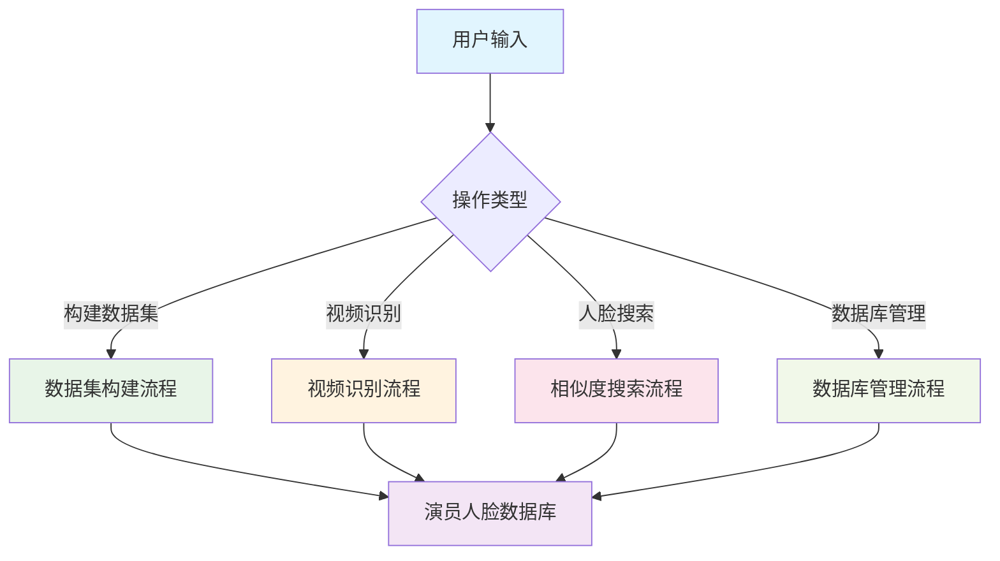
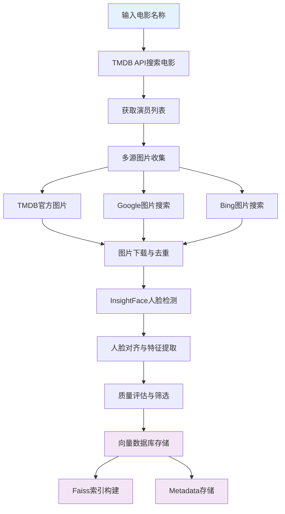
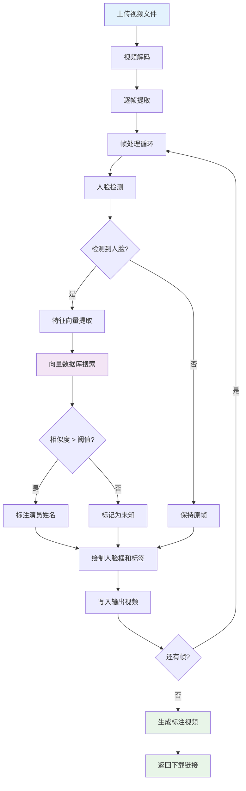
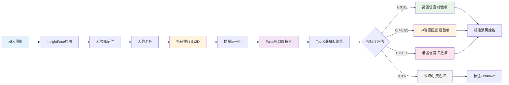
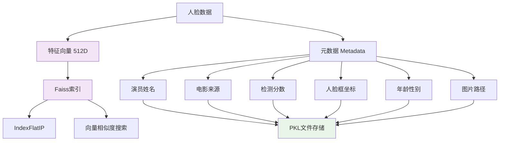
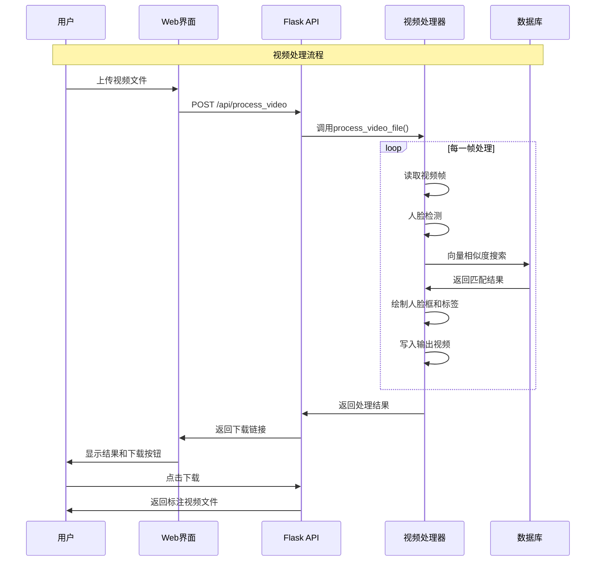
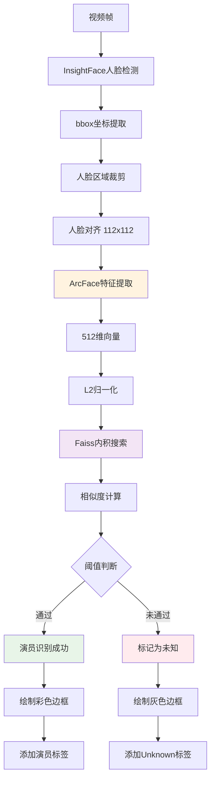
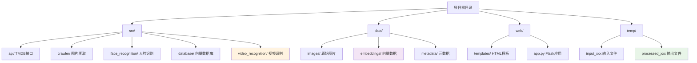
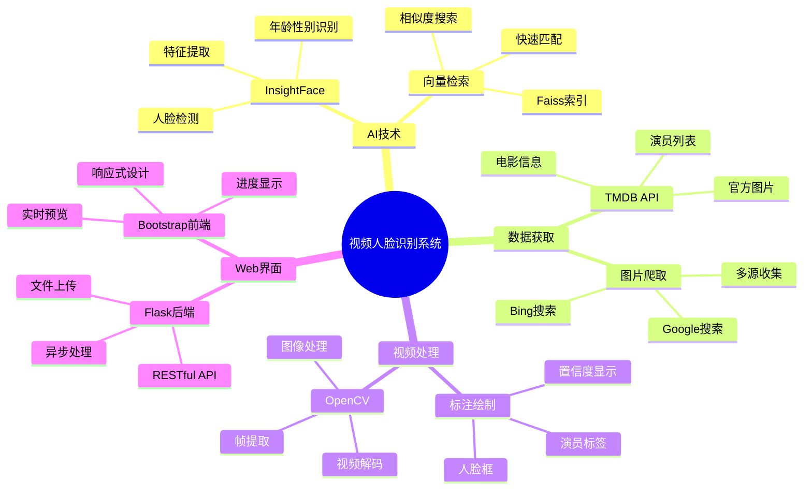

# 🎬 电影演员人脸数据库构建与视频识别系统流程图

## 🏗️ 整体系统架构

```mermaid
graph TB
    A[用户输入] --> B{操作类型}
    
    B -->|构建数据集| C[数据集构建流程]
    B -->|视频识别| D[视频识别流程]
    B -->|人脸搜索| E[相似度搜索流程]
    B -->|数据库管理| F[数据库管理流程]
    
    C --> G[演员人脸数据库]
    D --> G
    E --> G
    F --> G
    
    style A fill:#e1f5fe
    style G fill:#f3e5f5
    style C fill:#e8f5e8
    style D fill:#fff3e0
    style E fill:#fce4ec
    style F fill:#f1f8e9
```

## 📊 数据集构建流程

```mermaid
flowchart TD
    A1[输入电影名称] --> A2[TMDB API搜索电影]
    A2 --> A3[获取演员列表]
    A3 --> A4[多源图片收集]
    
    A4 --> A5[TMDB官方图片]
    A4 --> A6[Google图片搜索]
    A4 --> A7[Bing图片搜索]
    
    A5 --> A8[图片下载与去重]
    A6 --> A8
    A7 --> A8
    
    A8 --> A9[InsightFace人脸检测]
    A9 --> A10[人脸对齐与特征提取]
    A10 --> A11[质量评估与筛选]
    A11 --> A12[向量数据库存储]
    
    A12 --> A13[Faiss索引构建]
    A12 --> A14[Metadata存储]
    
    style A1 fill:#e3f2fd
    style A12 fill:#f3e5f5
    style A13 fill:#f3e5f5
    style A14 fill:#f3e5f5
```

## 🎥 视频人脸识别流程

```mermaid
flowchart TD
    B1[上传视频文件] --> B2[视频解码]
    B2 --> B3[逐帧提取]
    
    B3 --> B4[帧处理循环]
    B4 --> B5[人脸检测]
    B5 --> B6{检测到人脸?}
    
    B6 -->|是| B7[特征向量提取]
    B6 -->|否| B12[保持原帧]
    
    B7 --> B8[向量数据库搜索]
    B8 --> B9{相似度 > 阈值?}
    
    B9 -->|是| B10[标注演员姓名]
    B9 -->|否| B11[标记为未知]
    
    B10 --> B13[绘制人脸框和标签]
    B11 --> B13
    B12 --> B13
    
    B13 --> B14[写入输出视频]
    B14 --> B15{还有帧?}
    
    B15 -->|是| B4
    B15 -->|否| B16[生成标注视频]
    
    B16 --> B17[返回下载链接]
    
    style B1 fill:#e3f2fd
    style B8 fill:#f3e5f5
    style B16 fill:#e8f5e8
    style B17 fill:#e8f5e8
```

## 🔍 人脸识别详细流程

```mermaid
flowchart LR
    C1[输入图像] --> C2[InsightFace检测]
    C2 --> C3[人脸框定位]
    C3 --> C4[人脸对齐]
    C4 --> C5[特征提取 512D]
    C5 --> C6[向量归一化]
    
    C6 --> C7[Faiss相似度搜索]
    C7 --> C8[Top-K最相似结果]
    C8 --> C9{相似度评估}
    
    C9 -->|≥ 0.85| C10[高置信度 绿色框]
    C9 -->|0.7-0.85| C11[中等置信度 橙色框]
    C9 -->|0.6-0.7| C12[低置信度 黄色框]
    C9 -->|< 0.6| C13[未识别 灰色框]
    
    C10 --> C14[标注演员姓名]
    C11 --> C14
    C12 --> C14
    C13 --> C15[标注Unknown]
    
    style C1 fill:#e3f2fd
    style C5 fill:#fff3e0
    style C7 fill:#f3e5f5
    style C10 fill:#e8f5e8
    style C11 fill:#fff3e0
    style C12 fill:#fce4ec
    style C13 fill:#f5f5f5
```

## 🗄️ 数据库存储结构

```mermaid
graph TD
    D1[人脸数据] --> D2[特征向量 512D]
    D1 --> D3[元数据 Metadata]
    
    D2 --> D4[Faiss索引]
    D4 --> D5[IndexFlatIP]
    D4 --> D6[向量相似度搜索]
    
    D3 --> D7[演员姓名]
    D3 --> D8[电影来源]
    D3 --> D9[检测分数]
    D3 --> D10[人脸框坐标]
    D3 --> D11[年龄性别]
    D3 --> D12[图片路径]
    
    D7 --> D13[PKL文件存储]
    D8 --> D13
    D9 --> D13
    D10 --> D13
    D11 --> D13
    D12 --> D13
    
    style D2 fill:#f3e5f5
    style D4 fill:#f3e5f5
    style D13 fill:#e8f5e8
```

## 🌐 Web界面交互流程

```mermaid
sequenceDiagram
    participant U as 用户
    participant W as Web界面
    participant A as Flask API
    participant V as 视频处理器
    participant D as 数据库
    
    Note over U,D: 视频处理流程
    
    U->>W: 上传视频文件
    W->>A: POST /api/process_video
    A->>V: 调用process_video_file()
    
    loop 每一帧处理
        V->>V: 读取视频帧
        V->>V: 人脸检测
        V->>D: 向量相似度搜索
        D->>V: 返回匹配结果
        V->>V: 绘制人脸框和标签
        V->>V: 写入输出视频
    end
    
    V->>A: 返回处理结果
    A->>W: 返回下载链接
    W->>U: 显示结果和下载按钮
    U->>A: 点击下载
    A->>U: 返回标注视频文件
```

## 🎯 核心算法流程

```mermaid
flowchart TD
    E1[视频帧] --> E2[InsightFace人脸检测]
    E2 --> E3[bbox坐标提取]
    E3 --> E4[人脸区域裁剪]
    E4 --> E5[人脸对齐 112x112]
    E5 --> E6[ArcFace特征提取]
    E6 --> E7[512维向量]
    
    E7 --> E8[L2归一化]
    E8 --> E9[Faiss内积搜索]
    E9 --> E10[相似度计算]
    
    E10 --> E11{阈值判断}
    E11 -->|通过| E12[演员识别成功]
    E11 -->|未通过| E13[标记为未知]
    
    E12 --> E14[绘制彩色边框]
    E13 --> E15[绘制灰色边框]
    
    E14 --> E16[添加演员标签]
    E15 --> E17[添加Unknown标签]
    
    style E6 fill:#fff3e0
    style E9 fill:#f3e5f5
    style E12 fill:#e8f5e8
    style E13 fill:#ffebee
```

## 📁 文件系统结构

```mermaid
graph TD
    F1[项目根目录] --> F2[src/]
    F1 --> F3[data/]
    F1 --> F4[web/]
    F1 --> F5[temp/]
    
    F2 --> F6[api/ TMDB接口]
    F2 --> F7[crawler/ 图片爬取]
    F2 --> F8[face_recognition/ 人脸识别]
    F2 --> F9[database/ 向量数据库]
    F2 --> F10[video_recognition/ 视频识别]
    
    F3 --> F11[images/ 原始图片]
    F3 --> F12[embeddings/ 向量数据]
    F3 --> F13[metadata/ 元数据]
    
    F4 --> F14[templates/ HTML模板]
    F4 --> F15[app.py Flask应用]
    
    F5 --> F16[input_xxx 输入文件]
    F5 --> F17[processed_xxx 输出文件]
    
    style F10 fill:#fff3e0
    style F12 fill:#f3e5f5
    style F17 fill:#e8f5e8
```

## ⚙️ 技术栈组合

```mermaid
mindmap
  root((视频人脸识别系统))
    AI技术
      InsightFace
        人脸检测
        特征提取
        年龄性别识别
      向量检索
        Faiss索引
        相似度搜索
        快速匹配
    
    数据获取
      TMDB API
        电影信息
        演员列表
        官方图片
      图片爬取
        Google搜索
        Bing搜索
        多源收集
    
    视频处理
      OpenCV
        视频解码
        帧提取
        图像处理
      标注绘制
        人脸框
        演员标签
        置信度显示
    
    Web界面
      Flask后端
        RESTful API
        文件上传
        异步处理
      Bootstrap前端
        响应式设计
        实时预览
        进度显示
```

